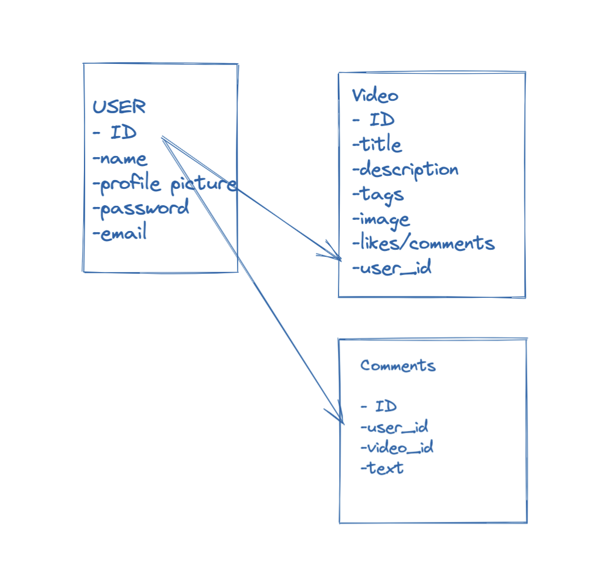

# polls-app

Django App ( Polls App ) ( documentation )
Part 1: Requests and responses
Part 2: Models and the admin site
Part 3: Views and templates ( should be able to complete up to this spot by Monday )
Part 4: Forms and generic views 
Part 5: Testing 
Part 6: Static files 
Part 7: Customizing the admin site

